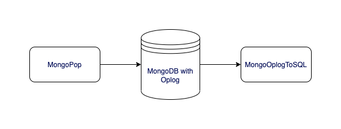

# Mongo-oplog-populator

MongoDB oplog populator (alias `mongopop`) allows you to simulate traffic (insert, update and delete) in MongoDB.
This repo is a companion repo for https://github.com/one2nc/mongo-oplog-to-sql.
If you want to test your `mongo-oplog-to-sql` binary on large data, you should use `mongopop`.

## How it works?

When you execute the `mongopop` command, the process dynamically generates databases and collections based on the configurations specified in the `.env` file. This dynamic creation of databases and collections is controlled by the values of `MAX_DB` and `MAX_COLLECTION` in the `.env` file.

`mongopop` supports two modes: bulk mode and stream mode. 

1. Bulk mode: Perform fixed number of operations provided by the user and terminate the program.
2. Stream mode: Perform fixed number of operations provided by user per second for indefinite time. The program stops only when the user gives a stop signal (ctrl+c)

The number of operations you specify via CLI are divided into insert, update and delete operations in following proportion.

- 85% Insert
- 10% updates
- 5% deletes

The `mongopop` utility carries out insert, update, and delete operations in a randomized manner. For instance, if you designate 100 operations, the distribution will be as follows: 85 of them will be inserts, 10 will be updates, and 5 will be delete operations. It's important to note that these operations are performed individually for each database collection.
To illustrate, consider the scenario where you execute `$ ./mongopop 100` with `MAX_DB=2` and `MAX_COLLECTION=2`. In this case, all 100 operations will be distributed across `database1.collection1`, `database1.collection2`, `database2.collection1`, and `database2.collection2`.

## Setup 
1. Setup mongo: Start a MongoDB replica server with 3 MongoDB instances (1 primary and 2 secondaries)
  
   `make setup`

2. Build the application: Builds a binary of mongo-oplog-populator, i.e. `mongopop`
   
   `make build`

3. Create a `.env` file. You can refer [.env.example](.env.example) file

4.  Run `./mongopop 10` for bulk operations  and 
        `./mongopop -s 10` for stream operations

     *  *./mongopop* is the binary file
     *  *-s* is the flag for stream operation
     *  *10* is the total number of operations to be performed in case of bulk insert and per second in case of stream insert
    

5. To connect to mongo cluster `make connect`

6. To check oplogs in mongo execute the following commands:
    - Change the database to local `use local` since all the oplogs are located in a file oplog.rs which is in local database
    - To see the oplogs generated:
      -  `db.oplog.rs.find({})` to see all oplogs
      -  `db.oplog.rs.find({op:"i"})` to see the insertions
      -  `db.oplog.rs.find({op:"u"})` to see the updates
      -  `db.oplog.rs.find({op:"d"})` to see the deletions

7. Tear down mongo
    `make setup-down`

NOTE: If you want to insert more records in mongo, run multiple instances of `mongopop`.

## License
This project is licensed under the [MIT License](./LICENSE)